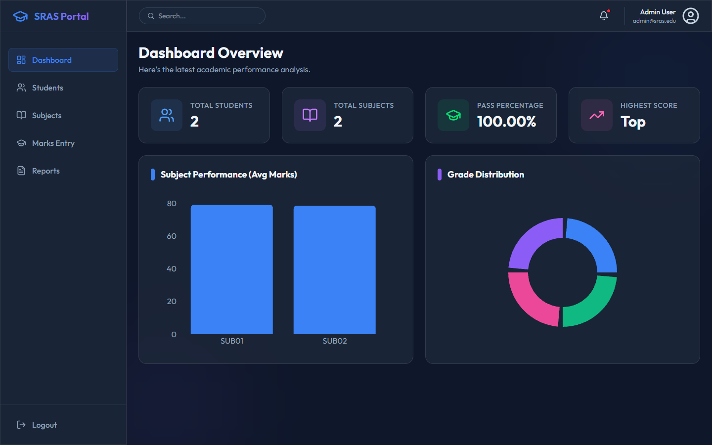
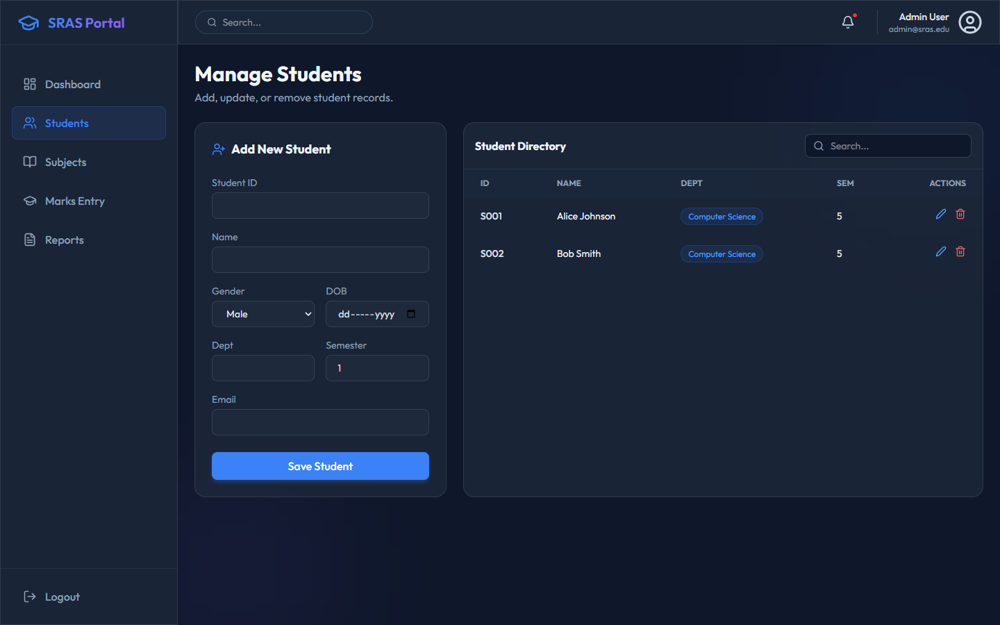
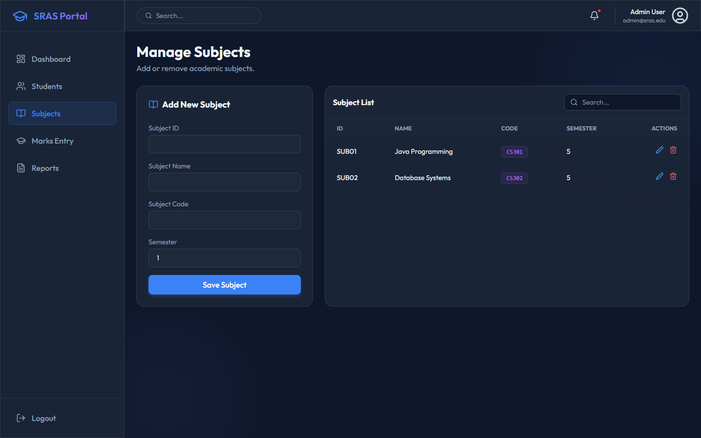
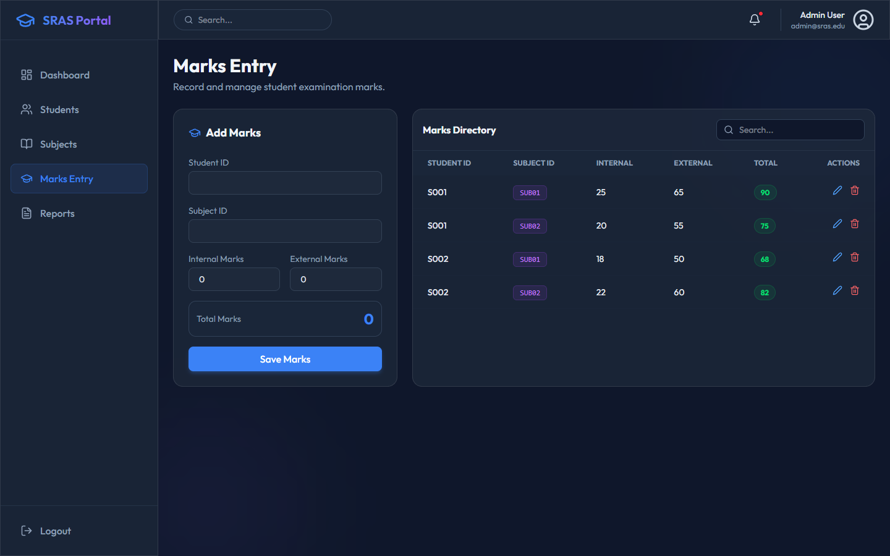

# Student Result Analysis System

## About the Project
The **Student Result Analysis System** is a comprehensive, full-stack Academic Results Management platform designed to handle student records, subjects, and examination marks. It features dynamic dashboards, reporting tools, and an integrated AI assistant. 

This repository is built as a **monorepo** containing two distinct interfaces for the same underlying system:
1. A modern **React/Node.js Web Application** for cloud or local web hosting.
2. A robust **Java Desktop Application** for standalone administrative use.

## Features & Context Added
- **AI Academic Assistant**: A conversational AI chatbot built with Google Gemini, deeply integrated into the frontend to provide guidance and answer academic questions directly on the platform.
- **Glassmorphism UI**: The web frontend uses premium, modern UI design patterns leveraging TailwindCSS and Framer Motion.
- **Data Visualization**: Live charts for subject performance and grade distribution via Recharts (Web) and JFreeChart (Java).
- **PDF & Excel Reporting**: Admins can generate and export analytical reports in PDF and Excel formats.
- **Unified Database**: Both applications talk to a single, centralized MySQL database (`sras_db`).

## Screenshots





---

## How to Run the Project

### Prerequisites
- **MySQL Server** (XAMPP or MySQL Workbench) running on port `3306`.
- **Node.js & npm** installed.
- **JDK 17+ & Maven** installed (if running the Java application).

### 1. Database Setup
First, initialize your database. Run the SQL script located at `StudentResultAnalysisSystem/database.sql` in your MySQL instance. This will create the database, tables, and insert default mock data.

### 2. How to Start the Web Application
The web app is a unified full-stack Node project (Express backend + React frontend).

**Step 2A: Backend Configuration (For the AI Chatbot)**
1. Open the `.env` file located in `StudentResultAnalysisSystem-Web/.env`.
2. Add your Google Gemini API key:
   ```env
   GEMINI_API_KEY=your_actual_key_here
   ```

**Step 2B: Install Dependencies & Build Frontend**
Navigate to the web application folder and install all packages:
```bash
cd StudentResultAnalysisSystem-Web
npm install
npm run build
```
*(The `npm run build` command transpiles the backend server and compiles the React frontend into static assets).*

**Step 2C: Start the Backend & Frontend Server**
```bash
npm start
```
This single command spins up the Express backend on port `3001` and securely serves the React frontend at the exact same URL. 
- **Open your browser to:** `http://localhost:3001`
- **Default Login:** `admin` / `admin123`

### 3. How to Start the Java Desktop Application
1. Import the `StudentResultAnalysisSystem` folder into your preferred Java IDE (IntelliJ, Eclipse, NetBeans) as a Maven project.
2. Ensure Maven downloads all dependencies (MySQL Connector, JFreeChart, Apache POI, iText).
3. Run the `Main.java` class located in `com.sras.Main` to launch the Desktop Swing GUI.
