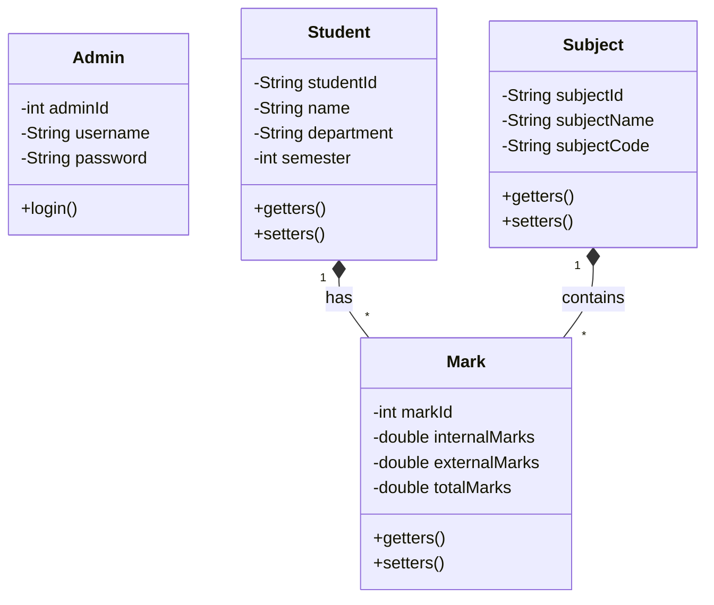

# Class Diagram

```mermaid
classDiagram
    class Admin {
        -int adminId
        -String username
        -String password
        +login()
    }
    class Student {
        -String studentId
        -String name
        -String department
        -int semester
        +getters()
        +setters()
    }
    class Subject {
        -String subjectId
        -String subjectName
        -String subjectCode
        +getters()
        +setters()
    }
    class Mark {
        -int markId
        -double internalMarks
        -double externalMarks
        -double totalMarks
        +getters()
        +setters()
    }
    
    Student "1" *-- "*" Mark : has
    Subject "1" *-- "*" Mark : contains
```
