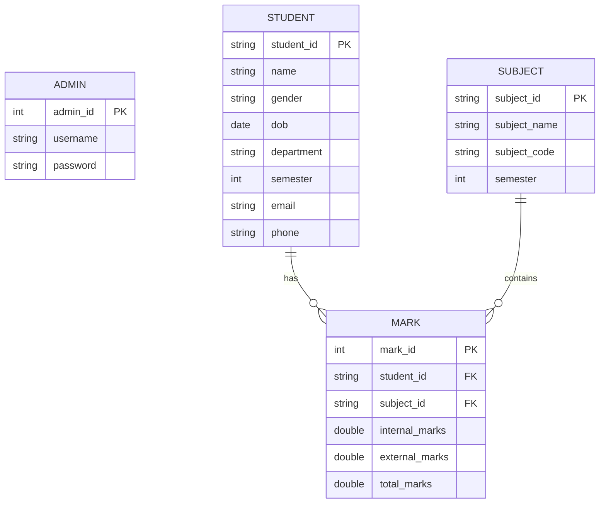

# Entity-Relationship (ER) Diagram

```mermaid
erDiagram
    ADMIN {
        int admin_id PK
        string username
        string password
    }
    STUDENT {
        string student_id PK
        string name
        string gender
        date dob
        string department
        int semester
        string email
        string phone
    }
    SUBJECT {
        string subject_id PK
        string subject_name
        string subject_code
        int semester
    }
    MARK {
        int mark_id PK
        string student_id FK
        string subject_id FK
        double internal_marks
        double external_marks
        double total_marks
    }

    STUDENT ||--o{ MARK : "has"
    SUBJECT ||--o{ MARK : "contains"
```
