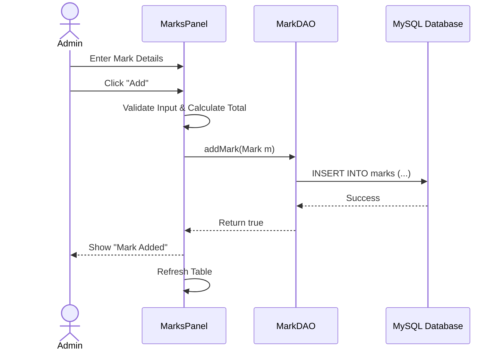

# Sequence Diagram - Add Marks

```mermaid
sequenceDiagram
    actor Admin
    participant UI as MarksPanel
    participant DAO as MarkDAO
    participant DB as MySQL Database

    Admin->>UI: Enter Mark Details
    Admin->>UI: Click "Add"
    UI->>UI: Validate Input & Calculate Total
    UI->>DAO: addMark(Mark m)
    DAO->>DB: INSERT INTO marks (...)
    DB-->>DAO: Success
    DAO-->>UI: Return true
    UI-->>Admin: Show "Mark Added"
    UI->>UI: Refresh Table
```
