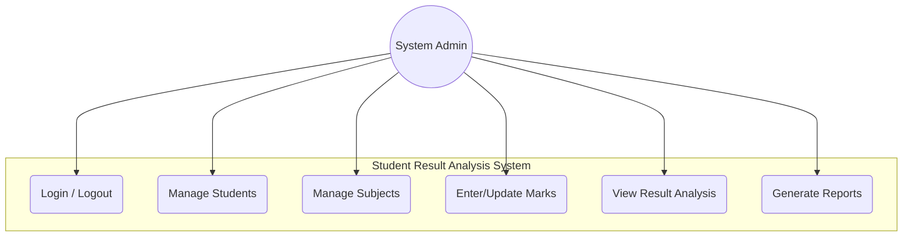

# Use Case Diagram

```mermaid
graph TD
    Admin((System Admin))
    
    subgraph System [Student Result Analysis System]
        UC1(Login / Logout)
        UC2(Manage Students)
        UC3(Manage Subjects)
        UC4(Enter/Update Marks)
        UC5(View Result Analysis)
        UC6(Generate Reports)
    end
    
    Admin ---> UC1
    Admin ---> UC2
    Admin ---> UC3
    Admin ---> UC4
    Admin ---> UC5
    Admin ---> UC6
```
